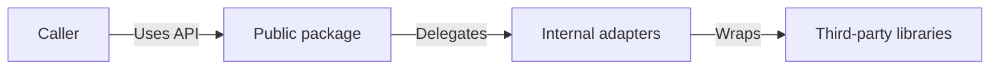

# Architecture and Engineering Guidelines

This guide describes how [PROJECT_NAME] is structured and how the codebase should evolve.

## Layered Architecture

- **Public API**: [DESCRIPTION]
- **Internal layer**: [DESCRIPTION]
- **Backends and dependencies**: [DESCRIPTION OF CONDITIONS FOR USING THIRD-PARTY LIBRARIES]
- **Data flow**: [DESCRIPTION OF DATA FLOW AND LIFETIMES]

### Module Layout

- `[FILE].go`: [PURPOSE]
- `internal/`: [PURPOSE]
- `tests/`: [PURPOSE]

### Panic Behavior

The library panics for **programmer errors**, not runtime failures.

| Condition | Example | Rationale |
|-----------|---------|-----------|
| [CONDITION_1] | `[CODE_EXAMPLE]` | [WHY_PANIC] |
| [CONDITION_2] | `[CODE_EXAMPLE]` | [WHY_PANIC] |
| [CONDITION_3] | `[CODE_EXAMPLE]` | [WHY_PANIC] |

Runtime errors return `error` values. See [secure_design.md](secure_design.md) for threat model.

## Guidelines

- **Idiomatic Go**: Follow Effective Go. SPDX headers in source files.
- **Nil semantics**: [HOW_NIL_IS_HANDLED]
- **Error strategy**: [WHEN_PANIC_VS_ERROR]
- **Encoding rules**: [CANONICAL_ENCODING_POLICY]
- **Minimal dependencies**: Propose new packages via issues before adding.

### Extending the Library

When adding new features or backends:

1. [STEP_1]
2. [STEP_2]
3. Update docs/roadmap.md and CHANGELOG.md

### Testing and Automation

- **Test vectors**: [SOURCE_OF_VECTORS if applicable]
- **Table-driven tests**: [DESCRIPTION]
- **Fuzz tests**: [LOCATION]
- **Property-based tests**: [DESCRIPTION]
- **CI**: Run validation suite per [CONTRIBUTING.md §5](../.github/CONTRIBUTING.md#5-quality-checks)

Add or update tests when modifying or extending functionality.

## Related Documents

- [CONTRIBUTING.md](../.github/CONTRIBUTING.md)
- [security_model.md](security_model.md)
- [roadmap.md](roadmap.md)
