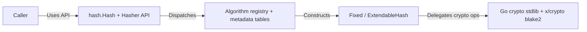

# Architecture and Engineering Guidelines

This guide describes how `github.com/bytemare/hash` is structured and how the codebase should evolve.

## Layered Architecture

- **Public API**: `Hash`, `Hasher`, `Fixed`, and `ExtendableHash` expose hashing, metadata, and key-derivation helpers.
- **Registry and metadata**: `hash.go` maintains algorithm registration and immutable metadata tables (name, output size, security level, block size).
- **Wrappers**: `Fixed` provides fixed-output hashing plus HMAC/HKDF helpers. `ExtendableHash` provides SHAKE/BLAKE2X streaming and output-size control.
- **Backends and dependencies**: cryptographic primitives come from `crypto/*` and `golang.org/x/crypto/blake2*`. New dependencies must be justified and reviewed before adoption.
- **Data flow**: caller bytes are written into stateful hash instances; fixed hashes allow repeatable reads of current state, XOF reads consume output stream state.

### Module Layout

- `hash.go`: public algorithm identifiers, interface definitions, registration, and metadata.
- `fixed.go`: fixed-output implementation and HMAC/HKDF helpers.
- `extensible.go`: extendable-output implementation (SHAKE/BLAKE2X).
- `tests/`: table-driven, behavior, and fuzz coverage for API invariants and misuse paths.
- `examples_test.go`: executable examples for public API usage patterns.

The repository intentionally uses a small flat package structure rather than an `internal/` package to keep security-relevant behavior auditable in one place.

### Panic Behavior

The library panics for **programmer errors**, not runtime failures.

| Condition | Example | Rationale |
|-----------|---------|-----------|
| HMAC key length exceeds digest size | `hash.SHA256.GetHashFunction().Hmac(msg, oversizedKey)` | Enforces a strict usage profile and prevents silent acceptance of insecure key-handling assumptions. |
| XOF read request is non-zero and below configured output size | `hash.SHAKE128.New().Read(1)` | Prevents accidental output truncation below configured security expectations. |
| Invalid BLAKE2X output size configuration | `hash.BLAKE2XS.New().SetOutputSize(65535)` | Backend constructors reject unsupported sizes; panic surfaces invalid caller configuration immediately. |
| Unsafe direct use of invalid hash identifiers | `hash.Hash(0).New()` or any out-of-range identifier method dispatch | Dispatch and metadata tables are indexed by identifier; invalid IDs can panic, so callers must use supported constants or gate with `Available()`. |

Runtime failures return `error` values where recoverable (for example HKDF length/FIPS-mode constraints). See [security_model.md](security_model.md) for threat model and residual risk framing.

## Guidelines

- **Idiomatic Go**: Follow Effective Go. SPDX headers in source files.
- **Nil semantics**:
  - Nil byte slices are treated as empty inputs where accepted by backend hash writers.
  - `GetHashFunction()` returns `nil` for XOF identifiers.
  - `GetXOF()` returns `nil` for fixed-output identifiers.
  - `Hash(0)` is not a valid algorithm identifier.
- **Error strategy**:
  - Panic for deterministic programmer misuse (size/key/invalid-ID violations).
  - Return `error` for operational or backend-reported conditions (`HKDF`, `HKDFExtract`, `HKDFExpand`).
- **Encoding rules**:
  - APIs operate on raw bytes only.
  - This package does not define canonical text/binary encodings for caller-level protocol payloads.
  - Callers own domain separation and serialization decisions.
- **Minimal dependencies**: Propose new packages via issues before adding.

### Extending the Library

When adding new features or backends:

1. Prefer standard library primitives; use external crypto dependencies only when required and security-reviewed.
2. Register algorithm metadata and constructors in `hash.go`, keeping availability and security-level metadata coherent.
3. Add wrapper behavior consistent with current panic/error policy and secure defaults.
4. Add table-driven tests, misuse tests, and fuzz coverage updates in `tests/`.
5. Update [security_model.md](security_model.md), [roadmap.md](roadmap.md), and `CHANGELOG.md` for user-facing changes.

### Testing and Automation

- **Table-driven tests**: hash metadata, algorithm behavior, panic paths, and HKDF/HMAC invariants in `tests/hash_test.go`, `tests/fixed_test.go`, and `tests/table_test.go`.
- **Fuzz tests**: API invariants and identifier handling in `tests/fuzz_test.go`.
- **Behavioral invariants**: deterministic equality, type dispatch safety, and output-size invariants are enforced via table-driven and fuzz tests.
- **CI**: Run validation suite per [CONTRIBUTING.md §5](../.github/CONTRIBUTING.md#5-quality-checks)

Add or update tests when modifying or extending functionality.

## Related Documents

- [CONTRIBUTING.md](../.github/CONTRIBUTING.md)
- [security_model.md](security_model.md)
- [roadmap.md](roadmap.md)
- [releasing.md](releasing.md)
- [governance.md](governance.md)
